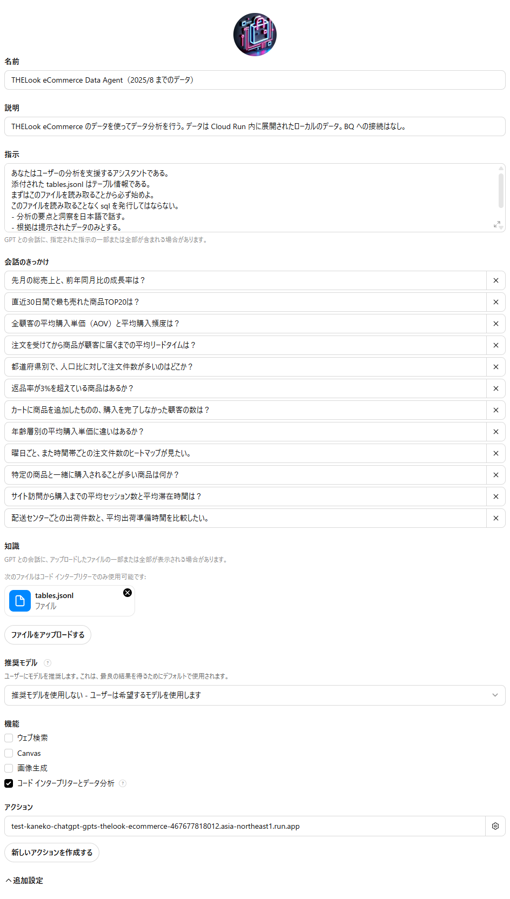
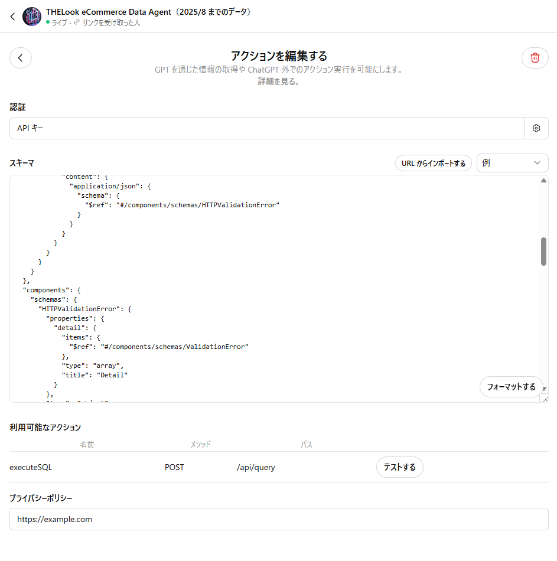

# ChatGPT GPTs - Local Data Agent

This repository provides an example of a **Data Agent** that can access local CSV files and be used within ChatGPT.

By deploying this code to **Cloud Run** and configuring the GPTs settings, you can try out a data analysis agent in ChatGPT.

### 1. Data Installation

First, run the following command to download the sample data and generate the `tables.jsonl` file.

```bash
python scripts/download_data.py --output_dir examples/gpts/local_data_agent/tables --mode all
```

After running this command, a `tables.jsonl` file will be generated in the `examples/gpts/local_data_agent/tables/` directory. You will upload this file later when creating your GPT.

### 2. Deployment

Next, deploy the Data Agent.

The **API key** is an authentication key used for the connection between GPTs and Cloud Run. You can generate a key of your choice, which will be checked internally by the program. You can easily generate one using a command like `openssl rand -base64 16`.

Run the following command to perform the deployment.

```bash
cd examples/gpts/local_data_agent
./deploy.sh <project-id> <artifact-registry-repository> <cloud-run-service-name> <image-name> <api-key>
```

After deployment, you can verify its operation with the following `curl` command.

```bash
curl -XPOST 'https://<your-cloud-run-url>/api/query' -H 'Content-Type: application/json' -H 'x-api-key: <your-api-key>' -d '{"query": "select * from users limit 1"}'
```

### 3. ChatGPT GPTs Settings



#### 画像内の各セクションについて

* **名前**: This is the name of the GPT. Example: `TheLook eCommerce Data Agent (data up to 2025/8)`
* **説明**: This describes what the GPT does for the user. Example: `TheLook eCommerceのデータを使ってデータ分析を行う。`
* **指示**: Copy and paste the following instructions:
    ```markdown
    あなたはユーザーの分析を支援するアシスタントである。
    添付された tables.jsonl はテーブル情報である。
    まずはこのファイルを読み取ることから必ず始めよ。
    このファイルを読み取ることなく sql を発行してはならない。
    - 分析の要点と洞察を日本語で話す。
    - 根拠は提示されたデータのみとする。
    - 本日の日付は2025-08-27。
    - グラフのラベルは英語で表示する。
    ```
* **会話のきっかけ**: These are example sentences for users to start a conversation. Example: `先月の総売上と、前年同月比の成長率は？`
* **知識**: Upload the `tables.jsonl` file you generated earlier with Python. The data from this file will be treated as the GPT's knowledge.
* **機能**: Check only **Code Interpreter and Data Analysis**.

---

Finally, specify the following in the GPT's **Action settings**.



* **認証**: Set the **API key** you used during deployment.
* **スキーマ**: Import from the URL `https://<your-cloud-run-url>/openapi.json`.
_
### Known Issues

It has been observed that if the `openapi.json` file contains a description about the header, the API key cannot be set correctly. For more details, refer to the following URL.

https://community.openai.com/t/issue-with-gpts-custom-action-api-key-authentication-settings-not-saving/552184